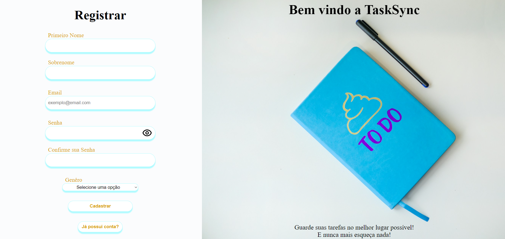
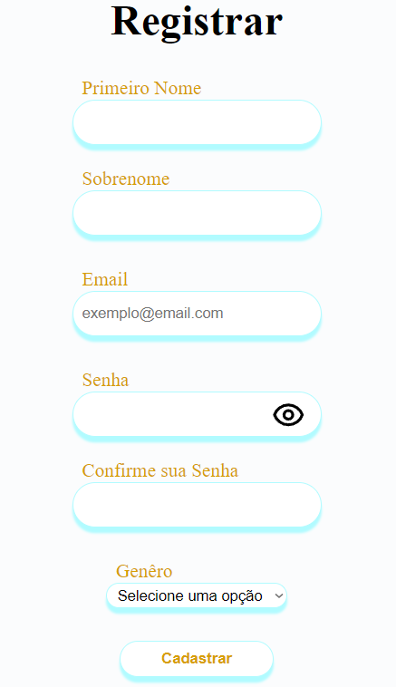

# Working with React

Este pequeno projeto `for fun` aborda o desenvolvimento front-end, focando em três áreas principais:

1. React: Utilizando React para criar componentes reutilizáveis, explorando conceitos como hooks, context API e organização modular da aplicação.
2. Fetch em Banco de Dados (JSON): Praticando a integração do React com bancos de dados JSON, praticando solicitações HTTP com a função fetch para obter e enviar dados dinamicamente.
3. Estilização Responsiva com CSS: Criando layouts flexíveis e adaptáveis utilizando CSS, incluindo media queries, flexbox e grid layout para garantir uma experiência consistente em diferentes dispositivos e tamanhos de tela.

# Instruções para o uso

1. Baixe o repositório do projeto.
2. Abra o terminal e vá ate o diretorio do projeto.
3. Execute `npm install` para instalar as dependências do projeto.
4. Após, execute `npm run dev` e aproveite!

# Imagens

+Register Page

+Login Page

# React + Vite

This template provides a minimal setup to get React working in Vite with HMR and some ESLint rules.

Currently, two official plugins are available:

- [@vitejs/plugin-react](https://github.com/vitejs/vite-plugin-react/blob/main/packages/plugin-react/README.md) uses [Babel](https://babeljs.io/) for Fast Refresh
- [@vitejs/plugin-react-swc](https://github.com/vitejs/vite-plugin-react-swc) uses [SWC](https://swc.rs/) for Fast Refresh
